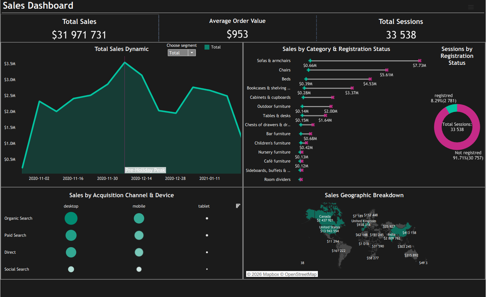

# Comprehensive E-Commerce Sales & Audience Performance Analytics (SQL + Python + Tableau)

[]
[]

A deep, data-driven analytics project combining **SQL (Google BigQuery)** for structural data extraction, **Python (Pandas, SciPy)** for Exploratory Data Analysis (EDA) and advanced non-parametric hypothesis testing, and **Tableau** for building an executive corporate dashboard.

The dataset evaluates web traffic metrics, purchase behaviors, and transactional seasonal fluctuations from **November 1, 2020, to January 27, 2021**.

---

## 🔗 Project Deliverables
* 📊 **[Interactive [] Dashboard on Tableau Public](https://public.tableau.com/views/ISDashboard_17791122307720/Dashboard1?:language=en-US&publish=yes&:sid=&:redirect=auth&:display_count=n&:origin=viz_share_link)**
* 📓 **[Google Colab Notebook with Analytical Code](LINK_TO_YOUR_COLAB_OR_REPO)**

---

## 🖼️ Corporate Executive Dashboard

## Dataset Description (Exploratory Data Analysis)

Based on the data extracted from Google BigQuery for the period from **November 1, 2020** to **January 27, 2021**, an initial analysis of the dataset structure was conducted.

### 1. General Characteristics
* **Total number of rows:** 33,538
* **Total number of columns:** 18
* **Number of unique sessions:** 33,538 (each row corresponds to a unique session)

### 2. Data Types
| Type | Volume | Columns |
| :--- | :--- | :--- |
| **Numeric** | 6 | `ga_session_id`, `account_id`, `is_unsubscribed`, `is_verified`, `price` |
| **Categorical (Object)** | 11 | `device`, `mobile_model_name`, `operating_system`, `language`, `browser`, `continent`, `country`, `channel`, `traffic_info`, `category`, `short_description`, `product_name` |
| **Datetime** | 1 | `date` |

### 3. Missing Values Analysis

The dataset exhibits a significant number of missing values in specific columns, which is determined by the nature of data collection.

| Column | Missing Count | Reason for Occurrence |
| :--- | :--- | :--- |
| `account_id` | 30,757 | Most users make purchases or browse without registration (guest sessions). |
| `is_unsubscribed`| 30,757 | Data is available only for registered user profiles. |
| `is_verified` | 30,757 | Email verification status exists only for created accounts. |
| `language` | 11,007 | Technical limitations of browsers or user privacy settings that do not transmit language parameters. |

**Conclusion:** The dataset primarily represents unauthorized traffic, which is typical for e-commerce stores.

---

# Part 1: Core Metrics, Geography, and Users

### 🌍 Geographical Sales Analysis: Leading Continents

Analysis of the distribution of total sales volume (Total Sales) and the number of orders (Total Orders) across continents revealed the absolute market leader — **the Americas macro-region**.

[INSERT CHART HERE]

| Continent | Sales Volume ($) | Number of Orders | Share in Sales (%) |
| :--- | :---: | :---: | :---: |
| **Americas** | 17M | 18,553 | ~58.6% |
| **Asia** | 7M | 7,950 | ~24.1% |
| **Europe** | 5M | 6,261 | ~17.3% |

#### 🔑 Key Insights:
* **Dominance of the American Market:** The **Americas** region generates over **58% of all corporate profits** ($17M) and accounts for the lion's share of transactions (18,553 orders). This is the key and most mature market for our e-commerce store.
* **Ratio of Asia and Europe:** **Asia** confidently holds the second place with a volume of $7M in sales and 7,950 orders. **Europe** closes the top three ($5M in sales and 6,261 orders).
* **Stability of the Average Order Value (AOV):** The distribution of orders is almost perfectly proportional to sales volumes across all three continents. This indicates that the average check (AOV) across different regions is approximately the same, and revenue scaling occurs precisely due to attracting a larger volume of sessions and transactions, rather than through selling more expensive items in specific regions.

### 🏳️ Geographical Sales Analysis: Leading Countries

Deep analysis broken down by specific countries confirms the critical dependence of the business on one key geographical market, and also forms a clear pool of regions for further scaling.

[INSERT CHART HERE]

| Country | Sales Volume, USD | Number of Orders | Average Order Value (AOV, USD) |
|:---|:---|:---|:---|
| United States | 13.94M | 14,673 | ~950 |
| India | 2.81M | 3,029 | ~927 |
| Canada | 2.44M | 2,560 | ~952 |
| United Kingdom | 0.94M | 1,029 | ~911 |
| France | 0.71M | 678 | ~1,047 |

#### 🔑 Key Insights:
* **Absolute Dominance of the US:** The United States is the primary source of revenue, generating **13.94M USD** in sales and ensuring **14,673 orders**. This accounts for about **41.5%** of the company's total turnover.
* **Potential of the Asian Vector (India):** **India** confidently holds the second place (**2.81M USD** and **3,029 orders**). This is a key market in the Asian region, demonstrating a high density of transactions.
* **Efficiency of the European Market (France):** Despite the fact that **France** closes the Top 5 in terms of total volume (0.71M USD and only 678 orders), it has the highest average order value among the leaders — **over 1,000 USD** per order.

### 📦 Category Analysis: Top 10 Product Categories

Analysis of the sales structure by product category allows assessing the company's product drivers, as well as aligning global consumer demand trends with customer preferences in the key market — the US.

[INSERT CHART HERE]

| № | Product Category | Total Revenue (USD) | Revenue in US (USD) | US Market Share (%) |
|:---|:---|:---|:---|:---|
| 1 | Sofas & armchairs | 8.39 M | 3.71 M | ~44.2% |
| 2 | Chairs | 6.15 M | 2.62 M | ~42.6% |
| 3 | Beds | 4.92 M | 2.21 M | ~44.9% |
| 4 | Bookcases & shelving units | 3.64 M | 1.57 M | ~43.1% |
| 5 | Cabinets & cupboards | 2.34 M | 0.99 M | ~42.3% |
| 6 | Outdoor furniture | 2.14 M | 0.93 M | ~43.5% |
| 7 | Tables & desks | 1.79 M | 0.78 M | ~43.6% |
| 8 | Chests of drawers & drawer units | 0.91 M | 0.38 M | ~41.8% |
| 9 | Bar furniture | 0.74 M | 0.33 M | ~44.6% |
| 10 | Children's furniture | 0.47 M | 0.21 M | ~44.7% |

#### 🔑 Key Insights:
* **Complete Identity of Consumer Behavior:** The structure of demand for the top 10 product categories at the global level and within the US is **absolutely mirror-identical**. The positions of all product groups in the ranking match one-to-one — from the absolute leader `Sofas & armchairs` to the closing position `Children's furniture`. This confirms the universality of the company's product portfolio and uniform furniture selection patterns regardless of the region.
* **Core of the Product Range (Top 3):** Three categories act as the main revenue drivers for the business: **Sofas & armchairs** (8.39M total), **Chairs** (6.15M), and **Beds** (4.92M). This trio forms the primary financial stream of the company.
* **Stable Share of the American Vector:** Across every product position, it is clearly visible that the US market stably accumulates **from 42% to 45%** of the total global revenue of a specific category. This once again emphasizes the critical dependence of the company's overall results on the success of the American division.

### 💻 Technical Analysis: Sales by Devices and Platforms

This stage of analysis allows determining the technical characteristics of the sessions that bring the highest revenue to the company. Due to the specifics of data collection (Google Analytics), the general device type (`device`) is detailed via the platform name or model (`model_name`), where web browsers are captured for desktops, and specific devices are captured for mobiles.

#### 📊 Global Distribution & Top 10 Platforms by Sales Share

[INSERT CHART HERE]

| № | Device Type (device) | Share (%) | | № | Platform / Model (model_name) | Share (%) |
|:---|:---|:---|:---|:---|:---|:---|
| 1 | **desktop** | 59.00% | | 1 | Chrome | 27.84% |
| 2 | **mobile** | 38.73% | | 2 | `<Other>` | 20.44% |
| 3 | **tablet** | 2.26% | | 3 | Safari | 20.30% |
|  | | | | 4 | iPhone | 20.08% |
|  | | | | 5 | ChromeBook | 5.73% |
|  | | | | 6 | Edge | 2.18% |
|  | | | | 7 | iPad | 1.40% |
|  | | | | 8 | Firefox | 1.32% |
|  | | | | 9 | Pixel 4 XL | 0.37% |
|  | | | | 10 | Pixel 3 | 0.34% |

#### 🔑 Key Insights:
* **Dominance of the Desktop Segment:** Over **59% of all revenue** is generated by desktop computer users (`desktop`). The main tools are `Chrome` (27.84%) and `Safari` (20.30%) browsers. This confirms that the classic web version of the site is the main and most converting monetization channel.
* **Smartphones as a Powerful Second Channel:** Mobile devices (`mobile`) firmly hold a share of **38.73%**. At the same time, a clear split is observed inside the mobile segment: **iPhone** users provide as much as **20.08%** of the company's total global sales, completely dominating over Android smartphones (the Pixel 3/4 lineups combined bring less than 1%).

### 🌐 Traffic Channels Analysis: Sales Distribution

This stage of analysis allows evaluating the effectiveness of marketing channels for user acquisition and understanding which sources generate the main volume of the company's financial results.

#### 📊 Sales Structure by Traffic Sources (Channel Type)

[INSERT CHART HERE]

| № | Traffic Channel (Channel Type) | Share of Total Sales (%) | Role in Marketing Strategy |
|:---|:---|:---|:---|
| 1 | **Organic Search** | 35.76% | Main driver of organic traffic (SEO) |
| 2 | **Paid Search** | 26.62% | Main paid acquisition channel (Contextual advertising) |
| 3 | **Direct** | 23.44% | Direct visits (Core loyal audience / Brand strength) |
| 4 | **Social Search** | 7.92% | Auxiliary acquisition channel via social networks |
| 5 | **Undefined** | 6.26% | Technical sessions with no defined UTM source |

#### 🔑 Key Insights:
* **Dominance of the Search Vector (Over 62%):** Combined, organic and paid search (`Organic Search` + `Paid Search`) provide over **62% of all company revenue**. This indicates that the product has an established demand, and users actively search for it through search engines.
* **Healthy Balance Between Traffic Channels and Costs:** The largest share of income is generated by free organic search (**35.76%**), pointing to strong SEO optimization and high site rankings. Meanwhile, paid advertising (`Paid Search` — **26.62%**) acts as a powerful fuel that supports a high rate of sales scaling.
* **High Level of Brand Loyalty:** Direct traffic to the site (`Direct`) generates nearly a quarter of revenue (**23.44%**). This is an excellent indicator for e-commerce, confirming that a significant portion of customers returns to the store directly (via bookmarks or memory), trusts the brand, and has a high Retention level.

### 👥 User Behavior Analysis: Geography, Verification, and Subscriptions

This stage of analysis allows evaluating the geographical distribution of the audience, the quality of the contact database of registered users, their level of interaction with the platform, and readiness to communicate via email marketing.

[INSERT 2 CHARTS HERE]

#### 📊 User Profile Metrics
| Metric | Profile Status / Region | Share of Total Accounts / Count |
|:---|:---|:---|
| **Geographical Leader** | United States (US) | 43.4% (1,207 accounts) |
| **Top 3 Markets** | US, India (246), Canada (207) | 59.7% (1,660 accounts combined) |
| **Email Verification** | Verified | 71.5% |
| | Not verified | 28.5% |
| **Subscription Status**| Subscribed | 83.9% |
| | Unsubscribed | 16.1% |

#### 🔑 Key Insights:
* **Audience Concentration in the US and English-speaking Regions:** The bulk of users are registered in the US — 1,207 accounts (43.4% of the total base). Combined with Canada and India, the three leading countries form 59.7% of all registrations. Marketing and email campaigns should target the English-speaking audience and the specifics of the American market.
* **Quality of Registrations:** The indicator of 71.5% verified addresses confirms the correct operation of the registration process and delivery of trigger emails. At the same time, 28.5% of users did not confirm their mail. To reduce this metric, it is advisable to test additional incentives (e.g., promo codes for new users with a focus on the US).
* **Conversion to Subscription:** 83.9% of users remain subscribed to the company's marketing newsletters. The Churn Rate stands at 16.1%, which is a standard indicator for retail. The existing database allows for effective setup of repeat sales through the email channel.

---

# Part 2: Sales Dynamics Analysis

# 📈 Overall Sales Dynamics and Seasonality Analysis

Analysis of weekly revenue metrics allows assessing the stability of cash flows, identifying periods of peak activity, and determining the presence of seasonal factors influencing sales volume.

### 📊 Dynamics of Total Sales by Weeks

[INSERT CHART HERE]

The chart displays changes in revenue volume (Total Sales in millions USD) with a one-week step for the period from November 2020 to February 2021.

#### 🔑 Key Insights:
* **Period of Maximum Financial Growth:** The highest level of sales was recorded in the first half of December. The peak of activity falls on the week of **2020-12-13**, when the revenue volume reached its maximum point — over **3.50M USD**. Growth starts from mid-November (from 2.00M USD) and lasts until mid-December, which is directly linked to the macroeconomic factor of pre-New Year purchases.
* **Trends and Seasonal Fluctuations:** Seasonality is clearly visible in the analyzed period:
  * **Pre-New Year Surge:** The period from November 22 to December 20 is characterized by a stably high demand with an average indicator above 2.80M USD per week.
  * **Post-Holiday Drop:** Immediately after the peak, a sharp drop in sales occurs almost twofold — to **2.00M USD** in the weeks of 2020-12-27 and 2021-01-03. This points to a complete decline in purchasing activity at the end of December and the beginning of January.
* **Second Wave of Activity (January Bounce):** After the holiday drop, a short-term market recovery is observed with a peak in the week of **2021-01-10** at the level of **2.75M USD**. This surge may be driven by the start of winter clearance sales or the fulfillment of backlogged orders.
* **Critical Drop at the End of the Period:** Starting from mid-January, the dynamics show a steady decline. In the week of **2021-01-31**, a drop in revenue to the minimum level — below **1.00M USD** — was recorded. This indicates the transition of the business into a low seasonal period after the conclusion of winter promotions.

# 📈 Multi-Factor Analysis of Sales Dynamics (Continents, Devices, Channels)

A comprehensive analysis of weekly revenue across geography, technical platforms, and acquisition channels allows localizing cash flow sources and identifying the drivers of the pre-New Year surge and post-holiday slump.

[INSERT 3-CHART IMAGE HERE]

---

### 📊 1. Sales Dynamics by Continents
The first chart displays the distribution of weekly revenue between key global macro-regions: Americas, Asia, and Europe.

#### 🔑 Key Insights:
* **Absolute Leadership of the American Market:** The Americas region is the main generator of the company's income throughout the entire analyzed interval. At the peak of pre-New Year sales (week of **2020-12-06**), the weekly revenue of this market reached an all-time high of **1.95M USD**, which is almost twice the combined income of Asia and Europe for the same period.
* **Synchronicity of Seasonal Fluctuations:** Despite the significant difference in scale, all three macro-regions demonstrate completely identical trends: simultaneous growth from November to early December, a sharp drop at the end of the year (minimum on **2021-01-03**), and a short-term January bounce. This points to a uniform global business model that depends equally on the worldwide calendar of holidays and sales.
* **Cluster Outlier — Europe:** The European market stably closes the top three leaders, not rising above the **0.70M USD** mark even during peak demand, indicating a weaker brand presence or higher competition in the European segment.

---

### 💻 2. Sales Dynamics by Device Types
The second chart details revenue depending on the platforms from which users made purchases: computers, mobile phones, and tablets.

#### 🔑 Key Insights:
* **Dominance of the Desktop Version:** Computers remain the main channel for converting traffic into real money. In the peak week of December, sales from desktops surpassed the **2.10M USD** mark. This is a classic indicator for e-commerce in the field of furniture or expensive items, where users tend to make final purchase decisions and execute large payments from large screens.
* **Mobile Traffic as a Stable Secondary Source:** Sales via mobile devices repeat the overall market dynamics, reaching a peak of **1.35M USD**. The stable gap between computers and smartphones indicates that the mobile version acts either as an auxiliary tool or a channel for quick purchases, but not as the main driver of ultra-high checks.
* **Complete Absence of Commercial Value for Tablets:** The share of tablets is close to zero throughout the reporting period (stable figures within **0.05M – 0.10M USD**). This channel responds neither to seasonal growth nor to sales, making it ineffective for further marketing investment.

---

### 🔗 3. Sales Dynamics by Acquisition Channels
The third chart visualizes the performance of marketing channels: organic search, paid advertising, direct entries, and social networks.

#### 🔑 Key Insights:
* **Fundamental Role of Organic Search:** Free search traffic brings the largest volume of revenue, reaching a peak of **1.35M USD**. This demonstrates a high level of search engine optimization of the platform, strong brand awareness, and an established base of loyal customers who search for products purposefully.
* **Efficiency of Paid Acquisition and Direct Traffic:** Paid advertising channels and direct site visits run almost parallel, providing **0.95M USD** and **0.78M USD** respectively during peak periods. The synchronous rise of paid traffic in November and December confirms the aggressive and justified scaling of marketing budgets during the high season.
* **Low Conversion of Social Networks:** The social media channel shows the lowest efficiency, keeping sales at the level of **0.20M – 0.30M USD** even at the peak of overall consumption. Social platforms in this business model work more as a media tool for product introduction rather than a platform for direct and fast sales.

### 📊 Visual Analysis of Sales Distribution (Heatmap)

This heatmap demonstrates the distribution of sales volumes (in thousands USD) between geographical markets and all product categories. The visualization allows identifying zones of maximum revenue concentration and comparing demand structures across countries.

[INSERT CHART HERE]

#### 🔑 Key Insights:
* **Dominance of the United States Market:** The highest sales figures are recorded in the United States (US) column. Sales in the sofas and armchairs category (`Sofas & armchairs`) in the US amount to 3,707.1K USD, which is the maximum figure in monetary equivalent for the entire business. The sales volume of secondary categories in the US exceeds the revenue from top categories in other countries.
* **Uniformity of Demand Structure:** The color gradation decreases from top to bottom uniformly for all analyzed countries. This indicates identical global consumption trends: in all regions, priority is given to the categories of sofas, chairs (`Chairs`), and beds (`Beds`), while minimal revenue is generated by office, children's, and bar furniture categories.
* **Comparative Analysis of Other Markets:** Sales figures in India and Canada are at a comparable level. For example, the beds category (`Beds`) generated 358.3K USD in India and 354.8K USD in Canada. The European cluster, represented by the UK and France, demonstrates the lowest sales volumes among the top 5 countries across all product categories.

### 🌍 Average Order Value Analysis (Continents vs. Device Types)

This pivot table displays the average order value (AOV in USD) depending on the geographical region of the customer and the type of device from which the purchase was made.

| Continent (continent) | Desktop (USD) | Mobile (USD) | Tablet (USD) |
|:---|:---:|:---:|:---:|
| **Africa** | 1030.02 | 907.48 | 987.14 |
| **Americas** | 962.17 | 936.26 | 966.60 |
| **Asia** | 940.15 | 971.46 | 1110.69 |
| **Europe** | 955.43 | 935.09 | 978.02 |
| **Oceania** | 1039.48 | 942.73 | 847.78 |

#### 🔑 Key Insights:
* **Global Stability and Homogeneity of Markets:** Calculation results show that the average check value practically does not depend on the device the user buys furniture from. In the three main global markets (**Americas, Europe, Asia**), AOV values on desktops and smartphones are nearly identical and stably remain within a narrow range from **935.09 to 971.46 USD**. Buyer behavior around the world is universal.
* **Specifics of Mobile Traffic:** The high level of average check on smartphones in the Americas (**936.26 USD**) and Europe (**935.09 USD**) proves that mobile users are ready to buy expensive and bulky goods on par with PC users. The mobile version of the platform is fully effective and does not limit customers in budget.
* **Regional Deviations and Anomalies:**
  * The highest average check was recorded in Asia on tablets (`Asia / tablet`) — **1,110.69 USD**, indicating isolated orders from the premium segment.
  * The `Africa` and `Oceania` markets show a shift of the check towards desktops (over 1030 USD), which might be due to the specifics of placing large orders or higher logistics costs to these regions.

---

# Part 3: Statistical Analysis

# 📉 Statistical Analysis of Relationships

### 1. Relationship Between the Number of Orders and Total Sales by Dates

To analyze the relationship between daily buyer activity and financial results, preliminary testing of the metrics' distribution for normality was conducted using the D'Agostino test (`stats.normaltest`).

* **Test result for daily revenue (`total_sales`):** $p$-value = 0.00715
* **Test result for the number of orders (`total_orders`):** $p$-value = 0.02338

**Justification for Metric Selection:** Since the $p$-value < 0.05 for both indicators, the hypothesis of their normal distribution was officially rejected. Right-side asymmetry (the presence of long tails towards high values) is clearly visible on the histograms, reflecting the specifics of e-commerce: days of large-scale sales or marketing campaigns create heavy outliers.

Under such conditions, Pearson's linear coefficient works incorrectly. To evaluate the relationship, **Spearman's non-parametric rank correlation coefficient (Spearman's rho)** was selected, as it is robust to deviations from normality and operates on data ranks.

#### 📊 Results of Spearman Correlation Calculation:
* **Spearman correlation coefficient ($r_s$):** 0.9510
* **Statistical significance ($p$-value):** $1.35 \times 10^{-45}$

#### 🔑 Key Insights:
* **Almost Perfect Link:** The coefficient value $r_s = 0.9510$ indicates an extremely strong, direct monotonic relationship between the number of completed carts and the final daily revenue. Order dynamics determine the financial success of the platform almost linearly: each new check stably scales the total revenue without dips in the average value of goods.
* **Absolute Statistical Significance:** The obtained $p$-value ($1.35 \times 10^{-45}$) tends to zero and is critically lower than the standard alpha level ($\alpha = 0.05$). This reliably proves that the uncovered relationship is a stable business pattern, and the risk of obtaining such a result by chance equals zero.

### 🌍 2. Sales Correlation Between Different Continents (Top 3)

To analyze the synchronicity of global sales, daily revenue in the company's three largest geographical markets was investigated: **Americas, Asia, Europe**. Since the preliminary test disproved the normality of daily metric distributions, the analysis was conducted using Spearman's non-parametric method.

#### 📊 Spearman Rank Correlation Matrix and Significance:
* **Americas vs. Asia:** $r_s = 0.6685$ ($p$-value $< 0.00001$)
* **Americas vs. Europe:** $r_s = 0.6259$ ($p$-value $< 0.00001$)
* **Asia vs. Europe:** $r_s = 0.6082$ ($p$-value $< 0.00001$)

#### 🔑 Key Insights and Business Analysis:
* **Moderate Stable Synchronicity of Markets:** Correlation coefficients between all three pairs of regions are in a stable range of **0.61 – 0.67**. This indicates a moderate positive relationship. The company's global financial flows partially depend on uniform factors: the brand's global marketing strategy, synchronous product updates on the site, or global sales events.
* **Effect of Geographical Diversification:** Since the correlation is not critically high (far from values of 0.90+), the markets retain a significant level of autonomy. Daily revenue in Asia or Europe does not blindly copy American trends. For business, this is a major plus: if due to local factors or force majeure, sales in one region temporarily drop, the company's overall stability will be sustained by the other two independent markets.
* **High Statistical Significance:** The calculated $p$-value values for all pairs tend to zero ($p < 0.00001$), which is significantly below the critical level $\alpha = 0.05$. This reliably proves that the identified interactions are a stable business pattern, rather than a random coincidence in daily data.

### 🚦 3. Sales Correlation Across Different Traffic Channels

To understand the interaction of marketing channels, daily revenue obtained from four main sources was analyzed: **Direct, Organic Search, Paid Search, Social Search**. The calculation was performed using the Spearman method due to the non-normality of daily distributions.

#### 📊 Spearman Rank Correlation Matrix:

| Traffic Channel | Direct | Organic Search | Paid Search | Social Search |
|:---|:---:|:---:|:---:|:---:|
| **Direct** | 1.0000 | 0.7482 | 0.6908 | 0.3937 |
| **Organic Search** | 0.7482 | 1.0000 | 0.7639 | 0.3848 |
| **Paid Search** | 0.6908 | 0.7639 | 1.0000 | 0.4204 |
| **Social Search** | 0.3937 | 0.3848 | 0.4204 | 1.0000 |

#### 🔑 Key Insights and Business Analysis:
* **Strong Synergistic Effect (Organic + Paid Search):** The highest correlation was recorded between `Organic Search` and `Paid Search` ($r_s = 0.7639$). This points to a powerful synergy: paid advertising stimulates interest in the brand, forcing users to search for goods on their own through search engines more frequently. There is no traffic "cannibalization" effect — the channels help each other scale total revenue.
* **Brand Capitalization Effect (Direct + Search):** Direct traffic (`Direct`) correlates strongly with both organic ($0.7482$) and paid advertising ($0.6908$). This means that marketing activity generates delayed demand and brand awareness: users who arrived from ads subsequently return to the site directly via bookmarks or by entering the address in a browser.
* **Isolation of Social Networks (Social Search):** The correlation of `Social Search` with other channels is weak ($0.38 – 0.42$). Sales from social networks live their own autonomous life and peak on other days. This indicates that SMM campaigns and targeted advertising attract a completely different audience segment, whose impulse purchases do not coincide with classic search traffic.
* **Statistical Significance:** All coefficients possess high statistical significance ($p < 0.05$), confirming the reliability of the identified relationships between money acquisition sources.

### 🛋️ 4. Sales Correlation Across Top 5 Product Categories

To identify hidden patterns in buyer behavior and locate complement goods (cross-purchases), daily sales volumes were analyzed across the five most popular furniture categories. Due to the non-normal distribution of data, Spearman's rank correlation coefficient was used.

#### 📊 Spearman Rank Correlation Matrix for Categories:

| Product Category | Sofas & armchairs | Chairs | Beds | Bookcases & shelving | Cabinets & cupboards |
|:---|:---:|:---:|:---:|:---:|:---:|
| **Sofas & armchairs** | 1.0000 | 0.5833 | 0.5217 | 0.6256 | 0.6312 |
| **Chairs** | 0.5833 | 1.0000 | 0.5349 | 0.6368 | 0.5268 |
| **Beds** | 0.5217 | 0.5349 | 1.0000 | 0.5427 | 0.4404 |
| **Bookcases & shelving**| 0.6256 | 0.6368 | 0.5427 | 1.0000 | 0.5287 |
| **Cabinets & cupboards**| 0.6312 | 0.5268 | 0.4404 | 0.5287 | 1.0000 |

#### 🔑 Key Insights and Business Analysis:
* **Comprehensive Room Furnishing (Chairs + Shelving):** The highest correlation is observed between chairs (`Chairs`) and bookcases (`Bookcases & shelving units`) — **0.6368**. This is a clear marker that customers tend to buy these goods simultaneously (e.g., equipping a home office or a study zone).
  * *Business Recommendation:* The site should set up bundles (complex offers with a discount) on study/office furniture to stimulate cross-sales.
* **Trends in Cabinet and Soft Furniture (Sofas + Cupboards):** The link between sofas (`Sofas & armchairs`) and cupboards (`Cabinets & cupboards`) is also quite strong (**0.6312**). This points to capital renovation or a complete update of living room interiors, where buyers take large furniture within the same time frame.
* **Autonomy of the Bedroom Segment (Beds):** The weakest link was recorded between beds (`Beds`) and cupboards (**0.4404**). Buying a bed is a more isolated process and less frequently coincides with updating other storage systems.

## 📊 Statistical Analysis of Differences Between Groups

### 1. Comparative Analysis of Sales for Registered and Unregistered Users

To study audience behavior, two daily samples were formed: total sales volume (revenue) for users without registration (`df_not_registred`) and for authorized users with an existing `account_id` (`df_registred`).

#### 📈 Normality Verification of Distributions:
* **Unregistered Users:** $p$-value = 0.00557 (normality hypothesis rejected)
* **Registered Users:** $p$-value = 0.01093 (normality hypothesis rejected)

**Justification for Statistical Test Selection:** Since both daily distributions turned out to be asymmetric and do not follow a normal distribution law ($p < 0.05$), using Student's parametric t-test is incorrect. To compare the samples, the non-parametric **Mann-Whitney U-test** was chosen, which evaluates the probability that values in one group are systematically higher than in another.

#### 🧪 Statistical Test Results:
* **Mann-Whitney U-statistic:** 0.0
* **Statistical Significance ($p$-value):** $2.22 \times 10^{-30}$ (tends to 0)

#### 🔑 Key Insights and Business Conclusions:
* **Absolute and Total Group Difference:** The obtained $p$-value ($p < 0.001$) confirms the presence of statistically significant differences between the groups. The indicator `statistic = 0.0` demonstrates a phenomenon of a total scale gap: daily sales volumes of unregistered users (scale of **200,000 – 600,000+ USD**) systematically and entirely exceed the revenue from registered clients (scale of **10,000 – 70,000 USD**) on every analyzed day.
* **Economic Interpretation for E-commerce:** Such a colossal difference in favor of site guests is a classic marker of Guest Checkout. The vast majority of furniture buyers prefer to place expensive orders quickly, without going through the registration procedure and creating a personal account. The registered base yields a stable but very small percentage of the site's total revenue.
* **Marketing Recommendation:** Attempts to force users to register before buying can harm conversion, as unregistered traffic generates over 85-90% of the platform's daily financial flow.

### 🚦 2. Analysis of Differences in the Number of Sessions Across Traffic Channels

To comprehensively evaluate the platform's marketing activity, an analysis of daily traffic density (number of sessions) was conducted across four main acquisition channels: **Direct, Organic Search, Paid Search, Social Search**.

**Justification for Test Selection:** Preliminary analysis showed that daily traffic metrics have a pronounced right-side asymmetry and contain outliers (marketing peaks). Due to violation of normality requirements for classic Analysis of Variance (ANOVA), a comparison of four independent groups was implemented using the non-parametric **Kruskal-Wallis H-test**.

#### 🧪 Statistical Evaluation Results:
* **Kruskal-Wallis H-test Statistic ($H$-stat):** 244.7949
* **Statistical Significance ($p$-value):** $8.74 \times 10^{-53}$

---

## 🎯 Key Takeaways & Strategic Recommendations

Based on the multi-layered analysis of the e-commerce platform's transactional data, technical parameters, and user behavior, the following key findings and business recommendations are established:

1. **Optimize for Guest Checkouts:** Statistical group difference testing via the Mann-Whitney U-test ($p < 0.001$) reveals that unregistered traffic acts as the primary financial lifeblood of the company, generating **85-90% of daily revenue (\$200K–\$600K+)**. Forcing user account creation during checkout represents a high risk to conversion rates. Mandatory registration should be avoided; instead, incentivize guest buyers to register *post-purchase* using value-added rewards.
2. **Double Down on the US Powerhouse & Target France for Premium Scaling:** The **United States** serves as the company's core market, single-handedly generating **41.5% (\$13.94M)** of total revenue. However, localized country metrics show that **France** commands an exceptional premium niche with an AOV exceeding **1,000 USD** (the highest among top markets). Future expansion strategies should feature aggressive allocation of PPC budgets to scale transaction volumes in the US, while deploying high-end, premium category campaigns specifically targeted at the French demographic.
3. **Deploy Product Bundles to Leverage Cross-Selling Synchronicities:** Spearman rank correlation matrices highlight strong purchase dependencies between certain categories, notably **Chairs and Bookcases/Shelving units ($r_s = 0.6368$)**, as well as **Sofas and Cabinets/Cupboards ($r_s = 0.6312$)**. These patterns indicate that customers frequently furnish entire rooms in single-purchase windows. Implementing smart bundle discount offers (e.g., "Home Office" or "Living Room" packages) on the interface can effectively increase cross-sales performance.
4. **Synchronize Multi-Channel Search Campaigns:** A powerful synergy exists between **Organic Search** and **Paid Search ($r_s = 0.7639$)**, indicating that targeted contextual ads effectively drive subsequent organic discovery without keyword cannibalization. Marketing budgets should align paid search bids with seasonal time-series insights—specifically building up aggressively from mid-November to ride the **Pre-New Year Peak (Week of Dec 13, breaking \$3.5M/week)** and stepping down funding before the massive late-December drop-off.
5. **Prioritize Desktop Web UI and Mobile iOS Experience:** Technical metrics reveal that **Desktop traffic dictates 59% of revenue**, heavily dominated by Chrome and Safari, while **iPhone sessions single-handedly claim 20.08%** of global platform sales (overshadowing Android options). UI/UX optimization and feature deployments must follow a desktop-first and iOS-centric engineering path to cater directly to the tech profiles of high-value consumers.
